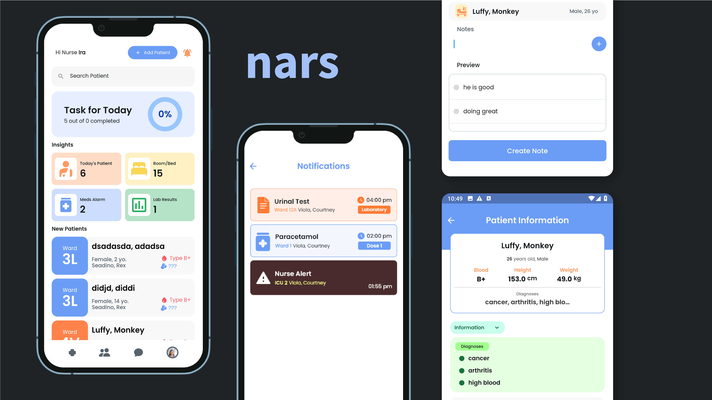

# nars

  

<h1 align="center">Nars</h1>

Nars is a mobile app for nurses, doctors, admins, and patients, streamlining patient management with efficient communication and collaboration tools.

# Healthcare Management System

## Core Features

### Patient Management
- Patient Information (demographics, medical history, etc.)
- Automatic patient account creation on admission
- Medical List (medications, allergies, adverse reactions)
- Patient History and Visitation Logs

### Staff Management
- User Role Management (nurse, doctor, admin, etc.)
- Assign Shifts and Departments
- Nurse Activity Log
- Access Controls

### Clinical Operations
- Vital Signs Tracking
- Trends and Patterns Analysis
- Intake and Output Sheets
- Lab Test Document Management
- Lab Results Management

### Communication and Collaboration
- Chat Function for real-time communication
- Emergency Alert System for Nurses
- Notifications (appointments, updates, etc.)

## Administrative Features

### User Management
- Change Password
- Profile/Settings

### Patient Engagement
- Patient Card (summary view)

### Administrative Controls
- Real-time updates
- Analytics and Reporting

# Team

- Courtney Viola - Project Manager, Lead Front-end Dev
- Ira Hans Dedicatoria - Full-Stack Dev, Back-end Lead
- Angel Arlene Siaboc - Front-end dev
- Kristian Raganas - Back-end dev
